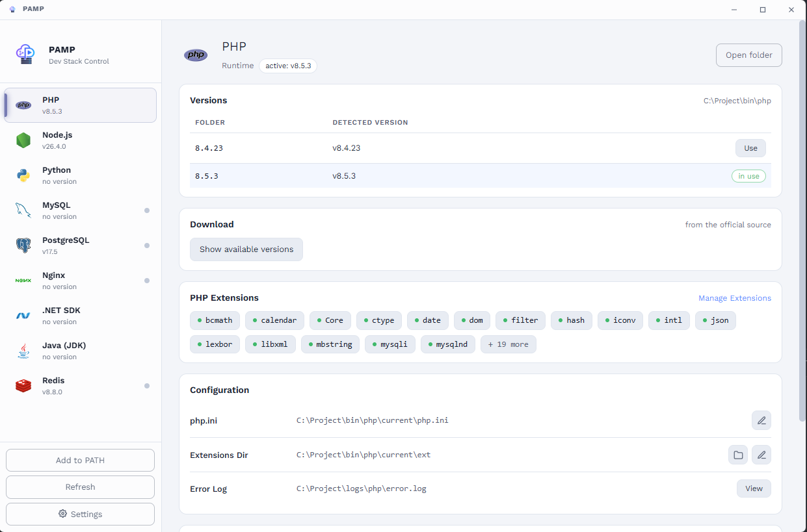

# PAMP — Dev Stack Control Panel

**PAMP** (PHP · Apache-alternative · MySQL · Python … and more) is a portable
dev stack for Windows. One window to install, switch and run every runtime and
server a developer needs — **PHP, Node.js, Python, Java, .NET, MySQL,
PostgreSQL, Nginx, Redis** — without touching your system.

Think Laragon, but portable, bilingual (English / ខ្មែរ) and open source.

## Features

- **Version manager** — keep many versions of each tool, switch the active one
  with one click.
- **One-click installs** — download any version straight from the official
  sources, right inside the app.
- **Service control** — start / restart / stop MySQL, PostgreSQL, Nginx and
  Redis with Docker Desktop-style buttons, live logs included.
- **Project scaffolding** — create Laravel, Vite, Django, Spring Boot and .NET
  projects from the UI; install Composer, phpMyAdmin and global npm tools
  (yarn, pnpm, bun, pm2, tsc, vite) with one click.
- **System tray** — close the window, keep your stack running.
- **Setup wizard** — guided first run: language, theme, startup, folders, PATH.
- **Light & dark themes · English & Khmer UI.**

## How fast?

- **Version switching is instant.** The active version is just a folder
  junction (`bin\<tool>\current`) — flipping it takes milliseconds, no
  reinstall, no rebuild, no admin prompt.
- **Zero-setup services.** MySQL and PostgreSQL data directories initialize
  themselves on first start; Redis and Nginx just run.
- **Portable.** The whole stack lives in one folder. Copy it to a USB stick or
  a new PC and everything still works.

## How easy?

- **No installer needed** — grab the portable exe and double-click.
- **No PATH juggling** — one button puts every tool on your user PATH; after
  that `php`, `node`, `python`, `java` … always point at whatever version is
  active in the app.
- **No config-file spelunking** — ports, document root, data folder, PHP
  extensions and startup behavior are all switches in the UI.
- **No terminal required** to spin up a new Laravel, Vite, Django, Spring Boot
  or .NET project — pick a name, pick a folder, click Create.

## Security

Local-dev tool with intentionally friction-free defaults — see
[SECURITY.md](SECURITY.md) before exposing anything to a network.

## License

[MIT](LICENSE)
